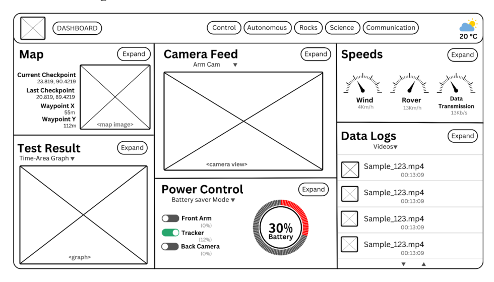
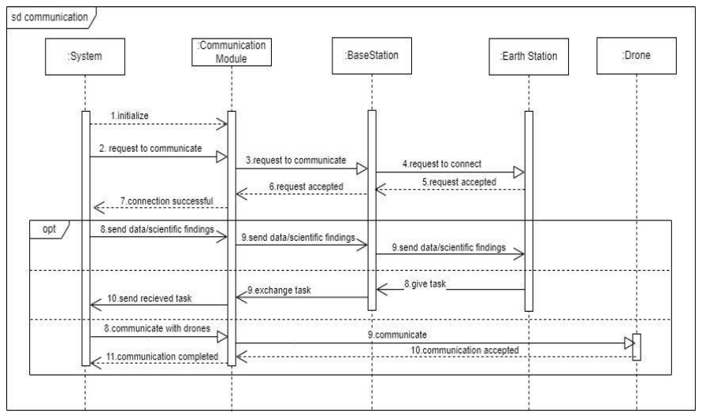

# Space Rover Application

A complete software design for an autonomous space rover and its ground control application: a rover that scans unknown terrain, plans its own routes, collects soil samples and weather data, and streams everything back through a base station to Earth, with graceful degradation (DTN fallback, return to last contact point) when communication drops.

This is a full system design exercise, not code: seven subsystems specified end to end with requirements, UML models, UI wireframes, and a test plan. The complete 54-page specification is in [Space Rover Application.pdf](Space%20Rover%20Application.pdf); everything below is extracted from it.

## Ground control dashboard

Live map with checkpoints and waypoints, camera feeds, wind and rover speed dials, power control with per-instrument toggles, and mission data logs. All 16 wireframes are in [diagrams/wireframes/](diagrams/wireframes/).

## The seven subsystems

| Subsystem | Priority | In one line |
|---|---|---|
| [Hardware Maintenance](docs/subsystems.md#1-hardware-maintenance-priority-high) | High | Pre-mission checkups, mid-mission failure handling: report, reboot, return to base |
| [Mission Status](docs/subsystems.md#2-mission-status-priority-high) | High | Vehicle health, mission progress and ETA, damage-avoidance predictions |
| [Mobility](docs/subsystems.md#3-mobility-priority-high) | High | Autonomous and manual driving with a safe mode-switch protocol |
| [Terrain Scanning and Way Pointing](docs/subsystems.md#4-terrain-scanning-and-way-pointing-priority-high) | High | Sensor fusion to terrain map to waypoints to planned path |
| [Weather Data Collection](docs/subsystems.md#5-weather-data-collection-priority-low) | Low | Wind, pressure, temperature, UV, logged and transmitted |
| [Communication](docs/subsystems.md#6-communication-priority-medium) | Medium | Rover to base to Earth relay, DTN fallback, drone links |
| [Soil Sample Collection](docs/subsystems.md#7-soil-sample-collection-priority-low) | Low | Site selection, drilling, containment, analysis |

Full requirement breakdown in [docs/subsystems.md](docs/subsystems.md).

## Design artifacts

Each subsystem is modeled four ways, all 24 diagrams extracted from the spec:

| | Use case | Class | Sequence | Activity |
|---|---|---|---|---|
| Hardware Maintenance | [view](diagrams/use-case/1.1_hardware-maintenance.png) | [view](diagrams/class/1.2_hardware-maintenance.png) | [view](diagrams/sequence/1.3_hardware-maintenance.png) | [view](diagrams/activity/1.4_hardware-maintenance.png) |
| Mission Status | [view](diagrams/use-case/2.1_mission-status.png) | [view](diagrams/class/2.2_mission-status.png) | [view](diagrams/sequence/2.3_mission-status.png) | [view](diagrams/activity/2.4_mission-status.png) |
| Mobility | [view](diagrams/use-case/3.1_mobility.png) | [view](diagrams/class/3.2_mobility.png) | [view](diagrams/sequence/3.3_mobility.png) | [view](diagrams/activity/3.4_mobility.png) |
| Terrain and Waypoints | [view](diagrams/use-case/4.1_terrain-scanning-and-way-pointing.png) | [view](diagrams/class/4.2_terrain-scanning-and-way-pointing.png) | [view](diagrams/sequence/4.3_terrain-scanning-and-way-pointing.png) | [view](diagrams/activity/4.4_terrain-scanning-and-way-pointing.png) |
| Soil Sample Collection | [view](diagrams/use-case/5.1_soil-sample-collection.png) | [view](diagrams/class/5.2_soil-sample-collection.png) | [view](diagrams/sequence/5.3_soil-sample-collection.png) | [view](diagrams/activity/5.4_soil-sample-collection.png) |
| Communication | [view](diagrams/use-case/6.1_communication.png) | [view](diagrams/class/6.2_communication.png) | [view](diagrams/sequence/6.3_communication.png) | [view](diagrams/activity/6.4_communication.png) |

A taste of the modeling depth, the communication path from rover to Earth with the drone link and DTN handling:

## Testing

Twenty scenario test cases across the six modeled modules, with priorities, preconditions, steps, and postconditions. The failure paths get their own cases: communication loss triggering the DTN fallback, and mid-mission hardware failure triggering reboot and return-to-base. Summary table in [docs/test-plan.md](docs/test-plan.md), full procedures in the PDF.

## Process

Built as a plan-driven Waterfall project on purpose: space systems are safety-critical with stable, well-defined requirements, which favors heavy up-front specification over adaptive iteration. The model comparison and role breakdown are in the PDF, section 1.

## Layout

| Path | What |
|---|---|
| `Space Rover Application.pdf` | The original full specification, source of everything here |
| `diagrams/` | All 40 figures extracted from the spec: use-case, class, sequence, activity, wireframes |
| `docs/subsystems.md` | The seven subsystems, requirements condensed |
| `docs/test-plan.md` | The 20 test cases at a glance |
